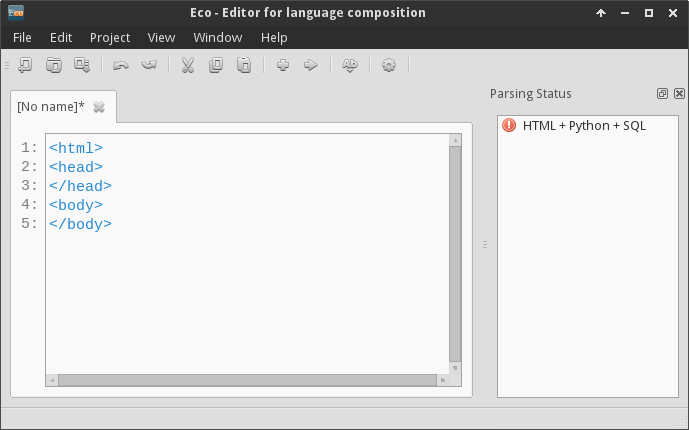
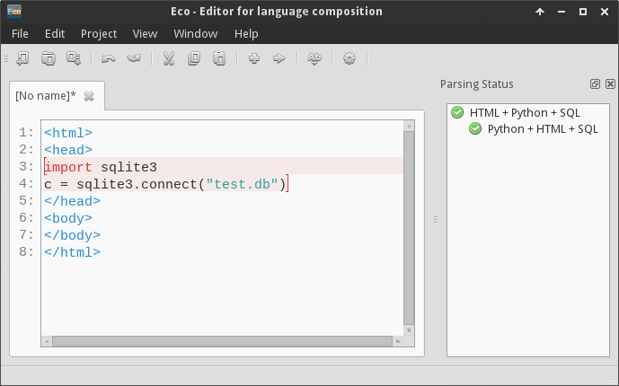
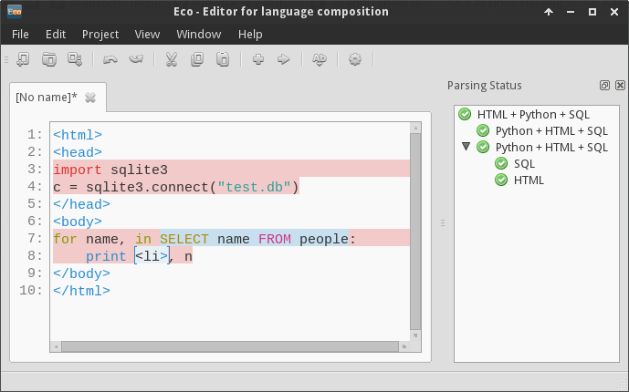
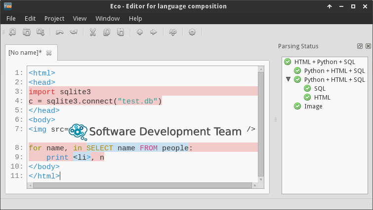

## Tutorial

This tutorial will help you explore a simple use case for Eco.

### Installation

Depending on how your version of Python was built, you may need to install
SQLite separately. To determine whether you need to do so, type "python2.7" at
the command line and then "import sqlite3". If that does not produce an error,
you can skip installation. Otherwise, you will need to install SQLite from
http://www.sqlite.org/download.html

You will then to generate a test database by executing these commands:
```
  $ wget https://bitbucket.org/softdevteam/eco/downloads/gendb.py
  $ python2.7 gendb.py
```
You can then run Eco in the normal way.

### Usage

Eco is a language aware editor. When creating a new file we need to specifiy in
which language we want to program. Select "File->New" and choose
"HTML + Python + SQL" from the list of languages.


We are now writing HTML. Type in the following:
```
<html>
<head>
</head>
<body>
</body>
```
At the moment our program is still invalid as shown by the red exclamation mark () under *Parsing status* on the right-hand-side of the editor.



Let's fix the program by closing the <html> tag. Type:
```
</html>
```

Eco incrementally reparses the program on every keystroke. We can see that as soon as we finish typing `</html>`, the parsing status becomes valid ().

#### Composed languages

Now we are going to add Python into our HTML program. The grammar we loaded
allows for composition of HTML, Python and SQL. Specifically HTML allows Python
code wherever it allows html-tags. Move your cursor right after `<head>` and
hit ENTER.

Now hit `CTRL+L` (or select Edit->Add language box from the menu). From the popup
menu select "Python + HTML + SQL".  Then type:
```
    import sqlite3
    c = sqlite3.connect("test.db")
```
We just created a language box inside of HTML containing Python code.



Let's create another one.

Move you cursor right after `<body>` hit ENTER and open up the language menu
again by hitting CTRL+L. Again select "Python + HTML + SQL" from the list and
then type:
```
    for n, in db:
        print html, n
```
In this code `db` and `html` are placeholders that we are going to replace with
further language boxes.


Delete the variable "db", create a new language box using "SQL" and then type:
```
    SELECT name FROM people;
```
Afterwards delete the variable "html" and replace it with a language box "HTML"
and type:
```
    <li>
```

Your code now should look somewhat like this:



Now we can export our program using "File->Export" and saving it as "web.py"
(make sure it is saved in the same location where you stored and executed
'gendb.py'). Afterwards we can run it:
```
    python2.7 web.py > web.html
```
Opening the resulting file "web.html" in a browser should now list people from
the SQL database.

#### Non-textual languages

Apart from different programming languages, Eco also has support for non-textual languages. To demonstrate this,
we included image support into the `HTML+Python+SQL` language. Type the following:

```

```

Now move the cursor after the `=` and press `Ctrl+L`. You will see that one of the highlighted language box options is `Image`. Select it and press `Enter`. Now type in the absolute path to an existing image on your harddrive and you should get a result similar to this:



More details at http://soft-dev.org/
